# Midnight Casino


> Privacy-first GameFi on Midnight — Compact ZK dual-ledger bets; prove fair settlement without publishing private intent.

Apache License 2.0 · Tags: `midnightntwrk`, `compact`, `typescript`

| | |
|---|---|
| **GitHub** | https://github.com/AmaanSayyad/Midnight-Casino/ |
| **Live Demo** | https://midnight-casino-eta.vercel.app/ |
| **Preprod MVP** | Contract `33d34f16…be92` · [deploy tx](https://explorer.1am.xyz/tx/7d30659622f8686bf809e0f0530c8611627af4203ccc169a2279c02e9ecc764d?network=preprod) |
| **Product X** | `[PASTE https://x.com/YOUR_PRODUCT_HANDLE — see docs/BUILD_IN_PUBLIC.md]` |
| **Google Form (L5)** | `[PASTE forms.gle link — see docs/GOOGLE_FORM.md]` |
| **Feedback sheet (L5)** | [`docs/feedback-sheet.csv`](docs/feedback-sheet.csv) · `[PASTE public Google Sheet URL after publish]` |
| **Users onboarded** | [`USERS.md`](USERS.md) — **0 / 50** Preprod |
| **Deck** | [Figma — Midnight Casino](https://www.figma.com/deck/fIrY9l7XwfGovD0G5lSGiV/Mignight-Casino?node-id=1-1812&t=W8Z7T69GDhVJM4H9-1&scaling=min-zoom&content-scaling=fixed&page-id=0%3A1) |
| **Demo video** | https://youtu.be/DVEq_W_Uzrk |
| **Privacy Wheel** | https://midnight-casino-eta.vercel.app/game/privacy-wheel |
| **Feedback / Onboard** | [/feedback](https://midnight-casino-eta.vercel.app/feedback) · [/onboard](https://midnight-casino-eta.vercel.app/onboard) |
| **Rise In challenge** | [`RISE_IN.md`](RISE_IN.md) |
| **Judging surface** | [`contracts/casino.compact`](contracts/casino.compact) |

## Contract Address

| Network | Address |
|---------|---------|
| Preview | `50a1cb0c358c57b52d32eb44d6c1054aa2d0352420fcb76ccd823b81ccac49f4` |
| Preprod | `33d34f168e360498df9b9e08baca1c999cdf50e61642f8af2888eaed7ec4be92` |

*(L1 Preview + L2 Preprod from Lace/1AM. Preprod deploy tx: [7d306596…c764d](https://explorer.1am.xyz/tx/7d30659622f8686bf809e0f0530c8611627af4203ccc169a2279c02e9ecc764d?network=preprod). Join with the 64-hex value above.)*

## Live Demo

https://midnight-casino-eta.vercel.app/  
Privacy Wheel: https://midnight-casino-eta.vercel.app/game/privacy-wheel  
On-chain Compact UI (Preprod MVP): `npm run midnight:dapp:preprod` → Join prefilled `33d34f16…be92`  
Level 4 runbook: [`docs/LEVEL4.md`](docs/LEVEL4.md) · Level 5: [`docs/LEVEL5.md`](docs/LEVEL5.md) · Build in public: [`docs/BUILD_IN_PUBLIC.md`](docs/BUILD_IN_PUBLIC.md)

## Product X profile

Required for Rise In Level 4. Create the account with the bio/posts in [`docs/BUILD_IN_PUBLIC.md`](docs/BUILD_IN_PUBLIC.md), then replace the table cell above with your live `https://x.com/...` URL.

## Level 5 — Users & feedback

Same Preprod MVP, refined through a feedback loop. Runbook: [`docs/LEVEL5.md`](docs/LEVEL5.md).

| Artifact | Link |
|----------|------|
| In-app feedback form | https://midnight-casino-eta.vercel.app/feedback |
| Onboard checklist | https://midnight-casino-eta.vercel.app/onboard |
| Google Form | Create with [`docs/GOOGLE_FORM.md`](docs/GOOGLE_FORM.md) → paste URL in header table |
| Public sheet (CSV / Excel) | [`docs/feedback-sheet.csv`](docs/feedback-sheet.csv) |
| Feedback write-up | [`docs/FEEDBACK.md`](docs/FEEDBACK.md) |
| Acquire 50 users | [`docs/ACQUIRE_USERS.md`](docs/ACQUIRE_USERS.md) |

### Table 1 — Onboarded Users (All)

Full 50-row tracker: [`USERS.md`](USERS.md). Summary columns: Name · Email · Wallet Address · Feedback Summary. **Current: 0 / 50.**

### Table 2 — Feedback Implementation (Selected)

| Name | Email | Wallet Address | Feedback Summary | Commit ID |
|------|-------|----------------|------------------|-----------|
| Cohort theme | — | — | Unclear first step / need checklist | [`daf12b8`](https://github.com/AmaanSayyad/Midnight-Casino/commit/daf12b8) |
| Cohort theme | — | — | Buttons feel dead without loading state | [`daf12b8`](https://github.com/AmaanSayyad/Midnight-Casino/commit/daf12b8) |
| Cohort theme | — | — | Public vs private still confusing mid-round | [`daf12b8`](https://github.com/AmaanSayyad/Midnight-Casino/commit/daf12b8) |
| Cohort theme | — | — | No place to leave structured feedback | [`9bdc76a`](https://github.com/AmaanSayyad/Midnight-Casino/commit/9bdc76a) |
| Cohort theme | — | — | Onboarding steps scattered | [`9bdc76a`](https://github.com/AmaanSayyad/Midnight-Casino/commit/9bdc76a) |
| Cohort theme | — | — | Compact dapp circuit order unclear | [`ec86b80`](https://github.com/AmaanSayyad/Midnight-Casino/commit/ec86b80) |

Themes and change log: [`docs/FEEDBACK.md`](docs/FEEDBACK.md). Docs pack: [`ead7341`](https://github.com/AmaanSayyad/Midnight-Casino/commit/ead7341).

### Improvement summary

| Change | Why | Docs |
|--------|-----|------|
| Round checklist + gated settle | Players did not know the circuit order | Privacy Wheel |
| Busy / loading button labels | Missing pending UX | Privacy Wheel |
| Public vs private legend | Privacy model not visible during play | Privacy Wheel |
| `/feedback` + CSV export | Structured L5 form fields | Next.js |
| `/onboard` six-step path | Reduce Preprod friction | Next.js |
| Compact dapp progress strip | Same MVP, clearer Lace path | `midnight-dapp` |

## What This Does

Midnight Casino lets players wager with **private bet intent**. Compact circuits commit a hidden choice/amount, then settle with selective disclosure of outcome and payout. Observers see commitments — not strategy or bankroll size.

## Privacy Model

- **PUBLIC** (on-chain, visible to anyone): `rounds` map (ownerHash, gameType, betCommit, status, outcome, payout, won), `nextRoundId`, `totalRounds`, `houseSeedCommit`
- **PRIVATE** (witnesses, never as raw ledger fields): `localSecretKey`, `getBetChoice`, `getBetAmount`, `getBetSalt`
- **PROVED without revealing**: round ownership and that the reveal matches the prior commitment, without publishing choice/amount/secret key

## Privacy Claim

An on-chain observer **can** see round commitments, game type, and (after settle) outcome/payout. They **cannot** see unsettled bet choice, stake size, or the player’s secret key — those remain private witnesses inside the ZK circuit.

## Tech Stack

Midnight Network · Compact · Node.js v22 · Docker proof server · Next.js · 1AM/Lace · TypeScript/Vitest · Vercel

## Prerequisites

- Node.js v22+
- Docker (proof server)
- Compact toolchain (`compact` on PATH)
- Lace or 1AM wallet (for on-chain deploy / play)

## Setup

```bash
export PATH="$HOME/.local/bin:$HOME/.compact/bin:$PATH"
git clone https://github.com/AmaanSayyad/Midnight-Casino.git
cd Midnight-Casino
npm install
cd midnight-contract && npm install && npm run compact && npm test && cd ..
npm run proof:up
npm run dev   # http://localhost:3000/game/privacy-wheel
```

## Run Tests

```bash
cd midnight-contract && npm test
# 9 passing — circuit logic, state transitions, privacy (no raw choice/amount on public view)
```

## Initial Idea

Midnight Casino is a privacy-first GameFi product on Midnight: players place bets whose choice, stake, and identity binding stay in Compact private witnesses, while the public ledger only stores commitments and — after settlement — a selectively disclosed outcome and payout. The Wave 1 / Rise In surface is a compiling `casino.compact` contract (placeBet → commitHouseSeed → settleWheel), simulator tests, and a playable Privacy Wheel plus Lace/1AM deploy path on Preview, so fairness is proved without doxxing strategy or bankroll.

## Screenshots

### Compact compile (4 circuits)

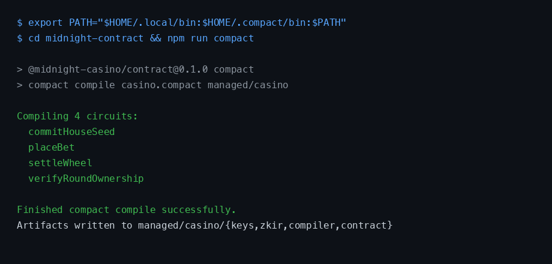

### Contract deployed on Preview (address visible)

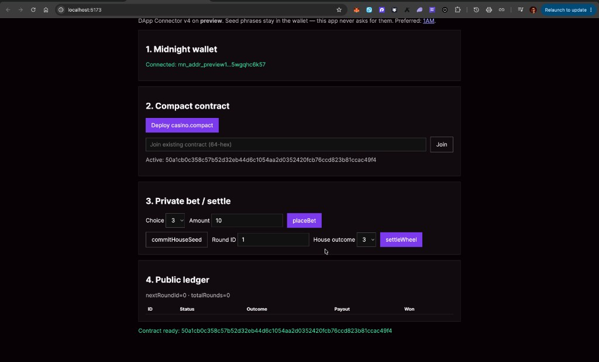

**Preview address:** `50a1cb0c358c57b52d32eb44d6c1054aa2d0352420fcb76ccd823b81ccac49f4`

### Contract deployed on Preprod (address visible)

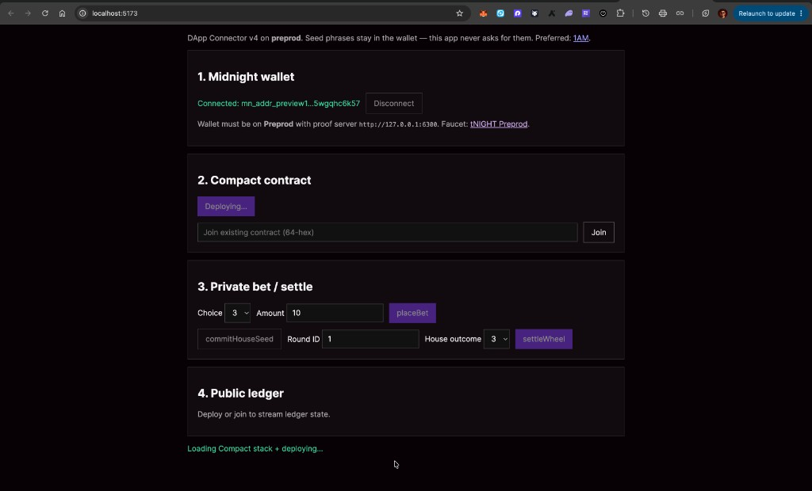

**Preprod address:** `33d34f168e360498df9b9e08baca1c999cdf50e61642f8af2888eaed7ec4be92`  
**Deploy tx:** https://explorer.1am.xyz/tx/7d30659622f8686bf809e0f0530c8611627af4203ccc169a2279c02e9ecc764d?network=preprod

## Product Proposal

**Chosen idea (Rise In L3 list):** Sealed-Bid Auction — private bids, verifiable winner.

Full write-up: [`PROPOSAL.md`](PROPOSAL.md) · Level 3 runbook: [`docs/LEVEL3.md`](docs/LEVEL3.md)

## Usage Guide

See [`docs/USAGE.md`](docs/USAGE.md)

## CI/CD


GitHub Actions (`.github/workflows/ci.yml`) on push/PR to `main`: install Compact 0.31.1 → `compact compile` → Vitest simulator (9) + Rise privacy gates (4) → verify `managed/` keys.

### Screenshot: tests passing (3+)

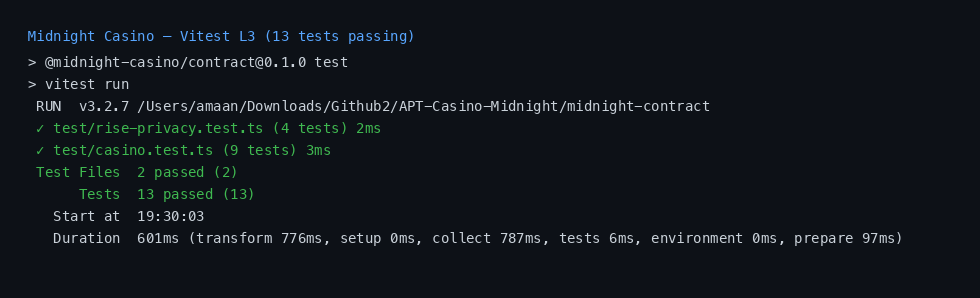

---

## What it does

Midnight Casino is a privacy-first GameFi app on **Midnight Network**. Players place bets whose **choice, stake, and identity binding stay private**, while the public ledger only sees commitments and — after settlement — a selectively disclosed outcome and payout.

The Wave 1 product surface is:

- A compiling **Compact** contract (`casino.compact`) with circuits `placeBet`, `commitHouseSeed`, `settleWheel`, and `verifyRoundOwnership`
- A playable **Privacy Wheel** at `/game/privacy-wheel` that mirrors that dual-ledger flow
- A full casino UI (wheel, mines, plinko, roulette) with **1AM / Lace** wallet connect, tNIGHT deposit/withdraw, and a live deploy at [midnight-casino-eta.vercel.app](https://midnight-casino-eta.vercel.app/)

---

## The problem it solves

Online casinos force a bad tradeoff:

- **Opaque houses** hide the RNG — players must trust the operator  
- **Public chains** publish every bet — strategy and bankroll get doxxed  
- **Off-chain “private” games** have no portable cryptographic proof when something goes wrong  

Midnight Casino uses Midnight’s **programmable privacy**: prove fair settlement **without publishing private bet intent**. Observers see commitments; only win/loss and payout are disclosed when the round settles.

---

## Challenges I ran into

- **Compact vs legacy EVM** — Early stack assumed Solidity/Pyth-style entropy. Buildathon judging needs Compact dual-ledger, so we moved EVM experiments to `legacy-evm/` and rebuilt the fairness model around witnesses + `disclose()`.
- **Proving & ops** — Local proof server (Docker), circuit compile (0.31.1), and managed proving keys had to stay reproducible for judges (`npm run compact` / `npm test`).
- **Wallet & dust UX** — 1AM/Lace deposit and treasury withdraw on Preview depend on sync, tDUST for fees, and sponsorship edge cases; first withdraws can stall until dust generates.
- **Deploy quirks** — Brand assets with `+` / spaces in paths 404 on Vercel; env and billing must target the correct team (`amaan002s-projects`).
- **Arcade vs Compact story** — Arcade games still need fast UX randomness; after removing Pyth we use local entropy there, while **Privacy Wheel remains the Compact fairness surface** so we don’t confuse judges.

---

## Technologies I used

- **Midnight Compact** (`casino.compact`, witnesses, selective disclosure)  
- **@midnight-ntwrk/** stack, proof server Docker, Preview network (tNIGHT / tDUST)  
- **TypeScript / Vitest** contract simulator  
- **Next.js** casino + Privacy Wheel UI  
- **1AM / Lace** DApp connector for wallet connect & transfers  
- **Vercel** production hosting  
- **Apache-2.0** for Midnight-related code  

---

## How we built it

1. Defined a **dual-ledger** Compact contract: private witnesses (secret key, choice, amount, salt) vs public rounds map (commitments, status, outcome, payout).  
2. Compiled four circuits and committed proving keys under `midnight-contract/managed/`.  
3. Wrote a **Vitest simulator** for place → house commit → settle and tamper rejection.  
4. Wired **Privacy Wheel** UI to the same semantics via `PrivacyCasinoClient`.  
5. Integrated **wallet connect**, treasury deposit, and on-chain withdraw API for playable tNIGHT loops.  
6. Documented judge path (compile → test → demo), Wave progress, and shipped a public repo + live Vercel demo.

---

## What we learned

- Midnight privacy is a **product shape**, not a bolt-on: what you hide (intent) and what you disclose (settlement) has to be designed into the UX.  
- Compact’s witness + ledger + `disclose()` model matches gaming better than “put the RNG on a public L1.”  
- Shipping for a Buildathon means **judge-reproducible artifacts** (compile, keys, tests, demo URL) matter as much as features.  
- Wallet dust/sponsorship and proof-server ops are first-class product risks on Preview — not afterthoughts.

---

## What's next for Midnight Casino

- **L5:** Fill 50 Preprod users + publish Google Form / sheet links ([`docs/LEVEL5.md`](docs/LEVEL5.md))
- **Wave 2 / L6 path:** Mainnet Compact deploy, brand assets, first real users
- **Beyond:** Compact circuits for Mines/Plinko private boards; indexer-backed settlement UX

---

## The story

Online gaming sits in a false choice: **opaque houses** (“trust us”) or **fully public chains** (every bet, bankroll, and strategy is doxxed). Players who want fairness usually pay with privacy; players who want privacy usually pay with trust.

Midnight Casino is built for the third path: **prove the game was fair without publishing private intent**. A player commits a hidden bet, the house commits entropy, settlement discloses only what must be public — win/loss and payout — while choice, stake size, and secret key stay in private witnesses.

Wave 1 ships that loop as a compiling Compact contract, simulator tests, and a playable Privacy Wheel on a public repo under Apache-2.0.

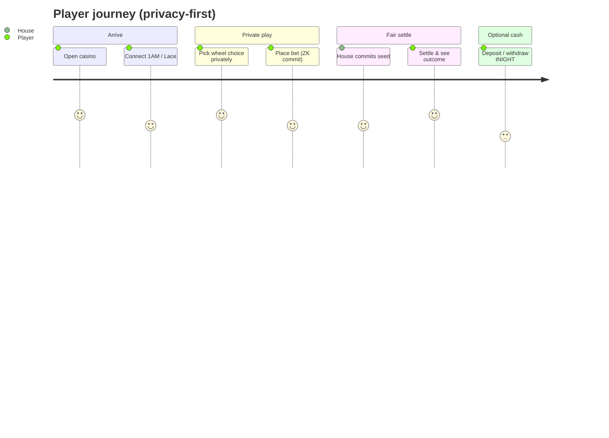

---

## The problem

| Failure mode | What goes wrong |
|---|---|
| Centralized RNG | Players cannot verify fairness; house can soft-rug trust |
| Public-chain bets | Strategy, stake, and bankroll leak on the mempool / explorer |
| “Private” off-chain | No portable proof; disputes become social, not cryptographic |
| Legacy EVM casino stack | Wrong tool for Midnight Buildathon — Solidity ≠ Compact dual ledger |

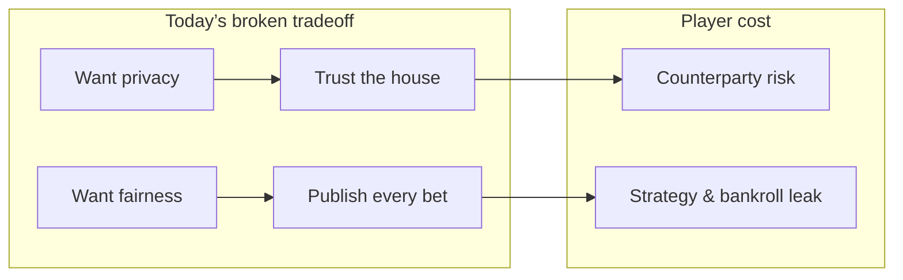

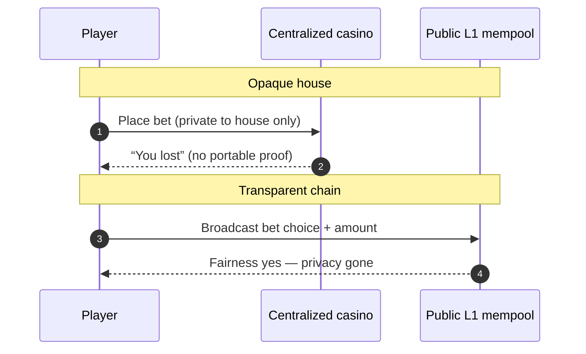

---

## The solution

**Midnight dual ledger + Compact circuits**

- **Private witnesses:** `localSecretKey`, `getBetChoice`, `getBetAmount`, `getBetSalt`
- **Public ledger:** round id, game type, bet commitment, owner hash, later outcome / payout
- **Circuits:** `placeBet` → `commitHouseSeed` → `settleWheel` (+ `verifyRoundOwnership`)
- **Product surface:** `/game/privacy-wheel`; proving keys under `midnight-contract/managed/`

| Data | Visibility |
|---|---|
| Secret key, choice, amount, salt | **Private** (witnesses) |
| Round id, game type, commitments | **Public ledger** |
| Outcome + payout after settle | **Selective disclosure** |

### Architecture (Compact-first)

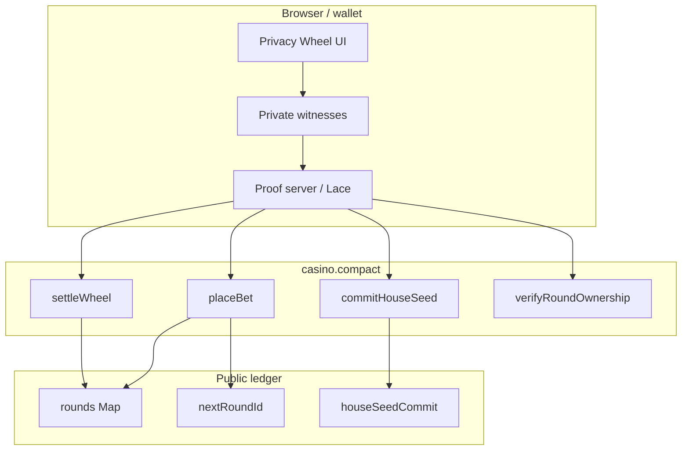

### Sequence — Privacy Wheel round

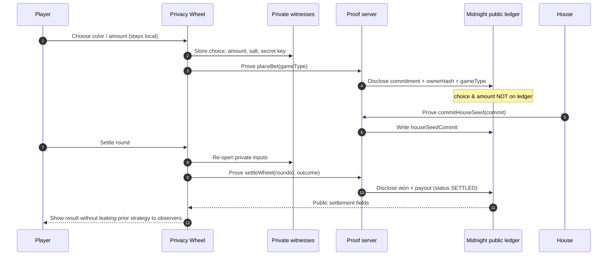

### Sequence — Deposit / play / withdraw

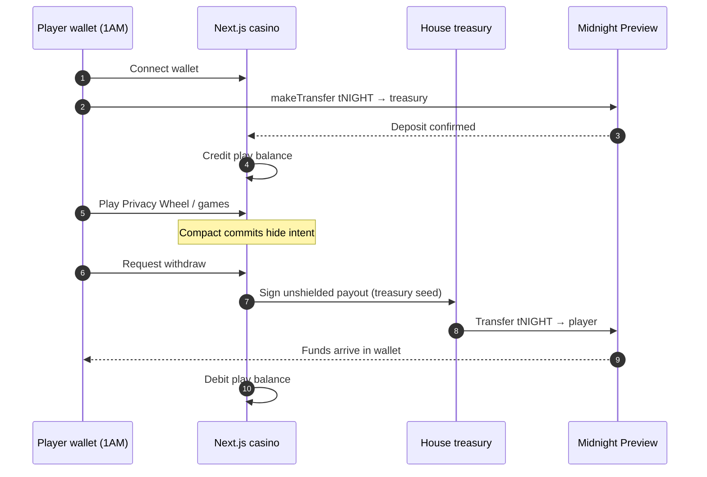

### Visibility over one round

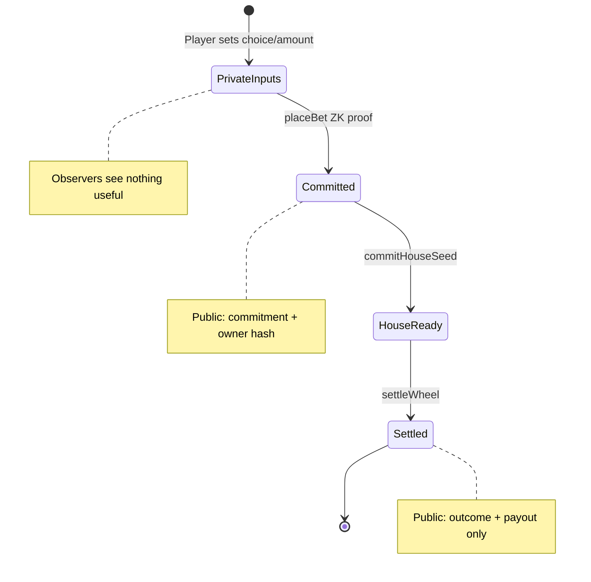

---

## The future

Roadmap aligns with Midnight Buildathon waves — not a rewrite to EVM.

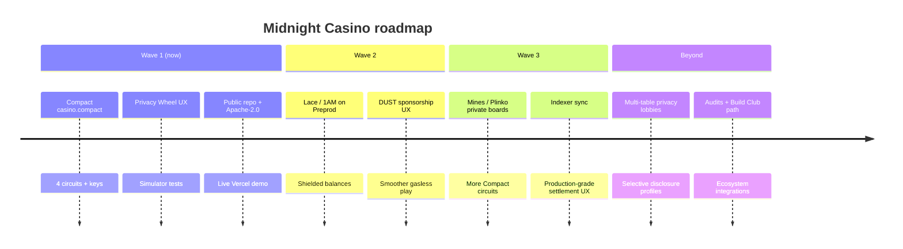

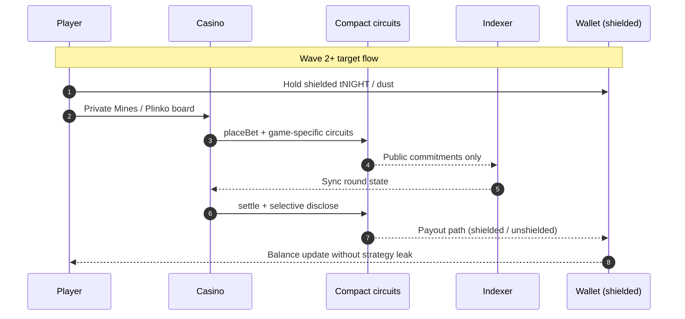

---

## Technical gate (Buildathon)

- Compact contract: [`midnight-contract/casino.compact`](midnight-contract/casino.compact)
- Compiles with Compact toolchain **0.31.1** / language **0.23** / runtime **0.16.0**
- Circuits: `placeBet`, `commitHouseSeed`, `settleWheel`, `verifyRoundOwnership`
- Private-state witnesses: `localSecretKey`, `getBetChoice`, `getBetAmount`, `getBetSalt`
- Proving keys committed under `midnight-contract/managed/casino/keys/`

```bash
# Install Compact: https://docs.midnight.network/getting-started/installation
export PATH="$HOME/.local/bin:$HOME/.compact/bin:$PATH"
compact update 0.31.1

cd midnight-contract
npm install
npm run compact    # must succeed
npm test           # simulator QA
```

- **Compact contract** — rules + dual ledger (`midnight-contract/`)
- **UI** — Next.js casino + Privacy Wheel at `/game/privacy-wheel`
- **Proof server** — `npm run proof:up` (Docker `midnightntwrk/proof-server`)
- **Legacy EVM** — archived Solidity experiments in `legacy-evm/` (not the Midnight submission surface)

## How judges can evaluate

1. **Compile gate**
   ```bash
   cd midnight-contract && npm run compact
   ```
   Expect: `Compiling 4 circuits` and artifacts in `managed/casino/`.

2. **QA**
   ```bash
   cd midnight-contract && npm test
   ```

3. **UX / end-to-end privacy demo**
   ```bash
   npm install   # repo root
   npm run dev
   ```
   Open [http://localhost:3000/game/privacy-wheel](http://localhost:3000/game/privacy-wheel)  
   Flow: set private choice/amount → `placeBet` → inspect public commitment → `commitHouseSeed` → `settleWheel`.

4. **Pitch deck** — [Figma deck](https://www.figma.com/deck/fIrY9l7XwfGovD0G5lSGiV/Mignight-Casino?node-id=1-1812&t=W8Z7T69GDhVJM4H9-1&scaling=min-zoom&content-scaling=fixed&page-id=0%3A1)

5. **Live demo** — https://midnight-casino-eta.vercel.app/ (Privacy Wheel: [/game/privacy-wheel](https://midnight-casino-eta.vercel.app/game/privacy-wheel))  
   **GitHub** — https://github.com/AmaanSayyad/Midnight-Casino/  
   **Demo video** — https://youtu.be/DVEq_W_Uzrk

6. **Wave progress** — see [`WAVE1_PROGRESS.md`](WAVE1_PROGRESS.md)

## Midnight integration details

| Circuit | Role |
|---|---|
| `placeBet(gameType)` | Commits hidden choice/amount; discloses only commitment + owner hash + game type |
| `commitHouseSeed(commit)` | House entropy commit for fairness |
| `settleWheel(roundId, houseOutcome)` | Owner proves commitment match; discloses win/loss + payout |
| `verifyRoundOwnership(roundId)` | Prove ownership without revealing secret key |

Dual-ledger: public `export ledger` fields vs private witnesses — same model as Midnight docs (bulletin board / leaderboard examples).

## Repo layout

```
midnight-contract/     # Compact source, managed artifacts, witnesses, vitest
src/app/game/privacy-wheel/  # UI wired to Compact semantics
src/lib/midnight/      # Client adapter mirroring circuits
proof-server/          # Docker Compose proof server
legacy-evm/            # Optional legacy Solidity (not required for judging)
LICENSE                # Apache-2.0
```

## Scripts

| Command | Purpose |
|---|---|
| `npm run compact` | Compile Compact contract |
| `npm run compact:test` | Run contract simulator tests |
| `npm run proof:up` | Start local proof server `:6300` |
| `npm run midnight:dapp` | Lace on-chain Compact UI `:5173` |
| `npm run dev` | Next.js frontend |

## Lace on-chain DApp

Full Lace + Compact deploy/bet UI lives in `midnight-dapp/` (Vite, port 5173).

```bash
npm run proof:up          # Docker proof server :6300
npm run midnight:dapp     # http://localhost:5173
```

See [`LACE_E2E.md`](LACE_E2E.md). Seed phrases stay in Lace — the app never requests them.

## Ecosystem attribution

Built with [Midnight Network](https://midnight.network/), [Compact](https://docs.midnight.network/compact), patterns from official examples ([leaderboard](https://github.com/midnightntwrk/midnight-leaderboard), [bulletin board](https://docs.midnight.network/examples/dapps/bboard)), and docs at https://docs.midnight.network/.

## License

Midnight-related Compact contract, witnesses, managed artifacts, Privacy Wheel UI adapter, and documentation added for this Buildathon are licensed under the **Apache License 2.0** — see [`LICENSE`](LICENSE). Pre-existing frontend/game assets may retain prior terms where applicable; judges can evaluate all Midnight functionality under Apache-2.0 paths listed above.
